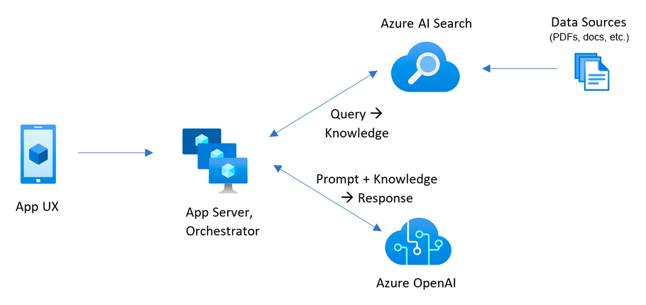
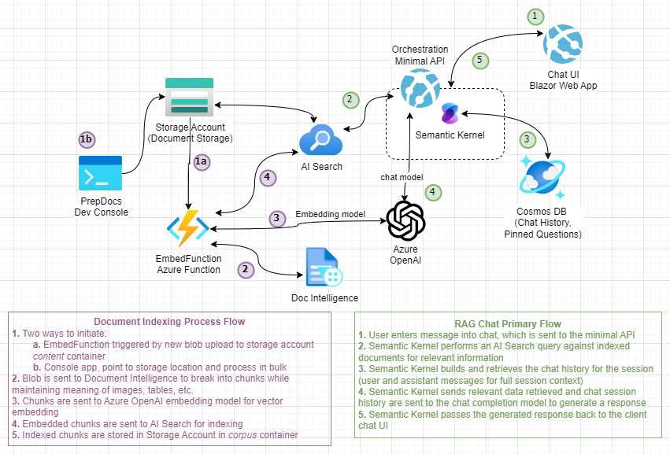
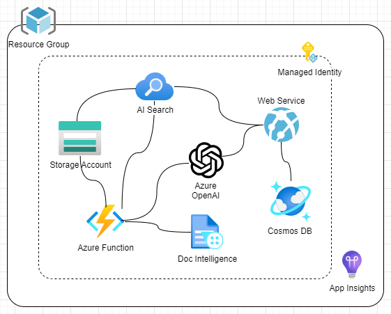
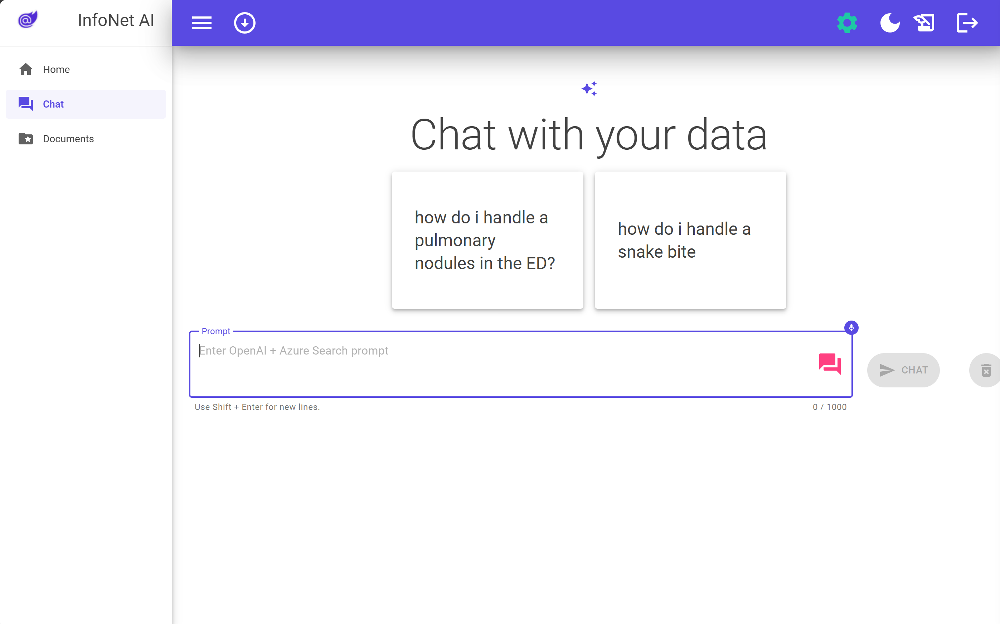

# Standard Chat with Enterprise Documents (.NET)
> A sample Blazor chat app over a minimal API implementation of a Semantic Kernel ochestrated Retrieval Augmented Generation (RAG) pattern using Azure OpenAI, AI Search and Document Intelligence. 

This example project used an Azure sample as a starting point, with simplifications and adjustments: [https://github.com/Azure-Samples/azure-search-openai-demo-csharp](https://github.com/Azure-Samples/azure-search-openai-demo-csharp). See [Resources](#resources) for more information. 

### Contents

- [Features](#features)
- [Application Architecture](#application-architecture)
- [Getting Started](#getting-started)
- [Project Setup](#project-setup)
- [Deployment](#deployment)
- [Running locally for Dev and Debug](#running-locally-for-dev-and-debug)
- [Considerations](#considerations)
- [Resources](#resources)

## What is RAG?
Retrieval Augmented Generation, or RAG pattern applications opinionated AI applications that pair the power of generative AI with curated data in order to allow users to chat with their own data. As illustrated in the diagram below, orchestration is done on an app server, which retrieves relevant data based on a natural language query, and passes that information to the model answer the user's question. 



## Features

* Natural language chat UI and AI generative answers
* RAG pattern via vector search on vector embedded documents (pdf, word, excel, images, ppt, html, tiff)
* Token usage tracking and limit handling within a conversation, with transparency in UI for user
* Save and delete persisted chat sessions by user
* Pin favorite queries by user, displayed as suggested questions on chat page
* blob triggered function to process, vector embed and index documents
* dev utility console app for bulk process, vector embed and index a container of documents

## Application architecture



- **User Interface** – The application’s chat interface is a [Blazor WebAssembly](https://learn.microsoft.com/aspnet/core/blazor/) application. This interface is what accepts user queries, routes request to the application backend, and displays generated responses.
- **Backend** – The application backend is an [ASP.NET Core Minimal API](https://learn.microsoft.com/aspnet/core/fundamentals/minimal-apis/overview). The backend, deployed to an Azure App Service, hosts the Blazor static web application and the Semantic Kernel orchestration of the different services. Services and SDKs used in the RAG chat application include:
   - [**Semantic Kernel**](https://learn.microsoft.com/en-us/semantic-kernel/overview) – orchestrates the RAG pattern completion between the services while managing chat history and other capabilities – ready for easy extension with additional plugin functions easy (more data sources, logic, actions, etc.).
   - [**Azure AI Search**](https://learn.microsoft.com/azure/search/search-what-is-azure-search) – searches indexed documents using [vector search](https://learn.microsoft.com/azure/search/search-get-started-vector) capabilities. 
   - [**Azure OpenAI Service**](https://learn.microsoft.com/azure/ai-services/openai/overview) – provides the Large Language Models to generate responses. 
- **Document Preparation** – shared embedding services are included and used by an `EmbedFunctions` Azure Function as well as a dev utility console app for chunking, embedding and indexing documents. The Azure Function is triggered on new blobs in the `content` container of the deployed storage account. For existing storage locations, the dev utility console app can be used to process an entire container in bulk. Services and SDKs used in this process include:
   - [**Document Intelligence**](https://learn.microsoft.com/en-us/azure/ai-services/document-intelligence/overview?view=doc-intel-4.0.0) – used for chunking the documents via the [pre-built layout model](https://learn.microsoft.com/en-us/azure/ai-services/document-intelligence/concept-layout?view=doc-intel-4.0.0&tabs=sample-code) for advanced handling of different document types with tables and other structures.
   - [**Azure OpenAI Service**](https://learn.microsoft.com/azure/ai-services/openai/overview) – provides the Large Language Models to generate vectoring embeddings for the indexed document chunks.
   - [**Azure AI Search**](https://learn.microsoft.com/azure/search/search-what-is-azure-search) – indexes embedded document chunks from the data stored in an Azure Storage Account. This makes the documents searchable using [vector search](https://learn.microsoft.com/azure/search/search-get-started-vector) capabilities.    

## Getting Started
This sample application, as deployed, includes the following Azure components.



### Account Requirements

In order to deploy and run this example, you'll need

- **Azure Account** - If you're new to Azure, get an [Azure account for free](https://aka.ms/free) and you'll get some free Azure credits to get started.
- **Azure subscription with access enabled for the Azure OpenAI service** - [You can request access](https://aka.ms/oaiapply). You can also visit [the Cognitive Search docs](https://azure.microsoft.com/free/cognitive-search/) to get some free Azure credits to get you started.
- **Azure account permissions** - Your Azure Account must have `Microsoft.Authorization/roleAssignments/write` permissions, such as [User Access Administrator](https://learn.microsoft.com/azure/role-based-access-control/built-in-roles#user-access-administrator) or [Owner](https://learn.microsoft.com/azure/role-based-access-control/built-in-roles#owner).

> [!WARNING]<br>
> By default this sample will create an Azure AI Search resource that has a monthly cost, as well as Document Intelligence (previously Form Recognizer) resource that has cost per document page. You can switch them to free versions of each of them if you want to avoid this cost by changing the parameters file under the infra folder (though there are some limits to consider)

### Cost estimation

Pricing varies per region and usage, so it isn't possible to predict exact costs for your usage. However, you can try the [Azure pricing calculator](https://azure.microsoft.com/pricing/calculator/) for the resources below:

- [**Azure App Service**](https://azure.microsoft.com/en-us/pricing/details/app-service/linux/)
- [**Azure Functions**](https://azure.microsoft.com/en-us/pricing/details/functions/)
- [**Azure OpenAI Service**](https://azure.microsoft.com/pricing/details/cognitive-services/openai-service/)
- [**Azure Document Intelligence**](https://azure.microsoft.com/pricing/details/form-recognizer/)
- [**Azure AI Search**](https://azure.microsoft.com/pricing/details/search/)
- [**Azure Blob Storage**](https://azure.microsoft.com/pricing/details/storage/blobs/)
- [**Azure Monitor**](https://azure.microsoft.com/pricing/details/monitor/)

### Project Setup

You have a few options for setting up this project. The easiest way to get started is GitHub Codespaces, since it will setup all the tools for you, but you can also set it up [locally](#running-locally-for-dev-and-debug) if desired. However, as many cloud resources are required to run the client app and minimal API even locally, deployment to Azure first will provision all the necessary services. 

#### GitHub Codespaces

You can run this repo virtually by using GitHub Codespaces, which will open a web-based VS Code in your browser:

[](https://github.com/codespaces/new?hide_repo_select=true&ref=main&repo=624102171&machine=standardLinux32gb&devcontainer_path=.devcontainer%2Fdevcontainer.json&location=WestUs2)

#### VS Code Remote Containers

A related option is VS Code Remote Containers, which will open the project in your local VS Code using the [Dev Containers](https://marketplace.visualstudio.com/items?itemName=ms-vscode-remote.remote-containers) extension:

[](https://vscode.dev/redirect?url=vscode://ms-vscode-remote.remote-containers/cloneInVolume?url=https://github.com/azure-samples/azure-search-openai-demo-csharp)

## Deployment
This project supports `azd` for easy deployment of the complete application, as defined in the main.bicep resources. Standalone APIM gateway only templates are also included for optionally deploying and configuring an Azure API Management gateway to use in between the application and Azure OpenAI deployments for scalability and failover.  

See [Deployment Instructions here](./infra/README.md).

### Process documents into the Search Service with Blob trigger

- In Azure: navigate to the deployed storage account.
- Browse into the `Data storage/Containers` blade and into the `content` container.
- Click `Upload` and add documents to be processed.
- Confirm successful indexing:
   - A new `corpus` container will be created in the storage account for processed documents.
   - A new `gptkbindex` index will be created in the AI Search Service. Open and search in the index to confirm content is properly searchable.

> [!NOTE]<br>
> It may take several minutes to see processed documents in the index

### Process documents in bulk with console app
TODO

### Run the deployed app

- In Azure: navigate to the Azure App Service deployed by `azd`. The URL is printed out when `azd` completes (as "Endpoint"), or you can find it in the Azure portal.
- When running locally, navigate to <http://localhost:7181> for the client app and <http://localhost:7181/swagger> for the Open API server page.

Once in the web app:

- Try different topics in **Chat** context. For chat, try follow up questions, clarifications, ask to simplify or elaborate on answer, etc.
- Explore citations and sources
- Pin favorite question for easy asking later
- Click the history icon at the top to view past chat sessions



### Tracing in App Insights

In Azure, navigate to the Application Insights deployed by `azd`.


To see any exceptions and server errors, navigate to the "Investigate -> Failures" blade and use the filtering tools to locate a specific exception. You can see stack traces on the right-hand side.

### Clean up resources

Run `azd down`

## Running locally for Dev and Debug

### First time setup

1. Set up a `local.settings.json` file:

``` json
{
    "Logging": {
      "LogLevel": {
        "Default": "Information",
        "Microsoft.AspNetCore": "Warning"
      }
    },
    "AllowedHosts": "*",
    "AZURE_CLIENT_ID": "",
    "APPLICATIONINSIGHTS_CONNECTION_STRING": "",
    "AZURE_STORAGE_BLOB_ENDPOINT": "",
    "AZURE_STORAGE_CONTAINER": "content",
    "AZURE_SEARCH_SERVICE_ENDPOINT": "",
    "AZURE_SEARCH_INDEX": "gptkbindex",
    "AZURE_FORMRECOGNIZER_SERVICE_ENDPOINT": "",
    "AZURE_OPENAI_ENDPOINT": "",
    "AZURE_OPENAI_CHATGPT_DEPLOYMENT": "chat",
    "AZURE_OPENAI_EMBEDDING_DEPLOYMENT": "embedding",
    "USE_AOAI":  "true"
  }
```

2. Configure role-based access to Cosmos for your identity:
   * Run `azd auth login`
   * Run the following command, replacing with your deployed values:
   ```powershell
   az cosmosdb sql role assignment create --account-name [COSMOS_RESOURCE_NAME] --resource-group [RESOURCE_GROUP_NAME] --scope "/" --principal-id [ENTRA_USER_OBJECT_ID] --role-definition-id /subscriptions/[SUBSCRIPTION_ID]/resourceGroups/[RESOURCE_GROUP_NAME]/providers/Microsoft.DocumentDB/databaseAccounts/[COSMOS_RESOURCE_NAME]/sqlRoleDefinitions/00000000-0000-0000-0000-000000000002
   ```

### Build and run locally
1. Run `azd auth login`
1. Run the following .NET CLI command to start the ASP.NET Core Minimal API server (client host):

   ```dotnetcli
   dotnet run --project ./app/backend/MinimalApi.csproj --urls=http://localhost:7181/
   ```

Navigate to <http://localhost:7181>, and test out the app.

## Considerations

This example is designed to be a starting point for your own production application, but on it's own is not production ready. Some additional considerations, although not exhaustive, are below. 

* **OpenAI Capacity**: The default TPM (tokens per minute) is set to 30K. That is equivalent to approximately 30 conversation turns per minute (assuming 1K per user message/response). You can increase the capacity by changing the `chatGptDeploymentCapacity` and `embeddingDeploymentCapacity` parameters in `infra/main.bicep` to your account's maximum capacity. You can also view the Quotas tab in [Azure OpenAI studio](https://oai.azure.com/) to understand how much capacity you have. Additionally, consider securing [Provisioned Throughput Units (PTUs)](https://learn.microsoft.com/en-us/azure/ai-services/openai/concepts/provisioned-throughput) for guaranteed capacity and predictable performance.
* **API Management**: Use of the APIM gateway for managing calls to LLM deployments can improve security, scalability, latency, monitoring and analytics. At a minimum, failover to multiple backend model deployments on exceeding token limit to ensure uninterrupted availability. See [Introducing GenAI Gateway Capabilities in Azure API Management](https://techcommunity.microsoft.com/t5/azure-integration-services-blog/introducing-genai-gateway-capabilities-in-azure-api-management/ba-p/4146525) for more information.
* **Azure AI Search**: If you see errors about search service capacity being exceeded, you may find it helpful to increase the number of replicas by changing `replicaCount` in `infra/core/search/search-services.bicep` or manually scaling it from the Azure Portal.
* **Azure Doc Intelligence Limits by SKU**: If documents are failing to process, embed and index, you may be hitting limitations due to select SKU. The free tier has a max document size of 4MB for processing through the layout model. For more information see [Input Requirements](https://learn.microsoft.com/en-us/azure/ai-services/document-intelligence/concept-layout?view=doc-intel-4.0.0&tabs=sample-code#input-requirements).
* **Azure Doc Intelligence Preview Support**: This project utilizes the preview v4.0 version of Document Intelligence in order to include support for O365 documents. This may not be suitable for production use, and is only available in certain regions at time of publishing this project. See [documentation](https://learn.microsoft.com/en-us/azure/ai-services/document-intelligence/overview?view=doc-intel-4.0.0) to check preview status and availability.
* **Azure Storage**: The default storage account uses the `Standard_LRS` SKU. To improve your resiliency, consider using `Standard_ZRS` for production deployments, which you can specify using the `sku` property under the `storage` module in `infra/main.bicep`.

## Resources

### Base sample app used
This project started with the sample application below:

[https://github.com/Azure-Samples/azure-search-openai-demo-csharp](https://github.com/Azure-Samples/azure-search-openai-demo-csharp)

### Noteable variations
* Deploys to App Service instead of Container App
* Updated Azure OpenAI deployments (GPT-4o, text-embedding-3-small)
* Upgraded to Doc Intelligence v4.0 preview SDK for Word document support
* Added Token usage tracking and limit handling with conversation history, and transparency in UI
* Added Cosmos DB for new feature support:
   * Chat Session history by user
   * Pinned queries by user
* Removed unnecessary features:
   * MAUI client support
   * Voice Chat client interface
   * GPT-4V and vision support
   * test projects
   * unnecessary SharedWebComponents (refactored shared library)

> [!NOTE]<br>
> The PDF documents used in this demo contain information generated using a language model (Azure OpenAI Service). The information contained in these documents is only for demonstration purposes and does not reflect the opinions or beliefs of Microsoft. Microsoft makes no representations or warranties of any kind, express or implied, about the completeness, accuracy, reliability, suitability or availability with respect to the information contained in this document. All rights reserved to Microsoft.

### Other Resources
- [Semantic Kernel Overview](https://learn.microsoft.com/en-us/semantic-kernel/overview)
- [Semantic Kernel GitHub](https://github.com/microsoft/semantic-kernel)
- [Azure AI Search](https://learn.microsoft.com/azure/search/search-what-is-azure-search)
- [AI Search - Vector Search](https://learn.microsoft.com/azure/search/search-get-started-vector)
- [Azure OpenAI Service](https://learn.microsoft.com/azure/cognitive-services/openai/overview)
- [`Azure.AI.OpenAI` NuGet package](https://www.nuget.org/packages/Azure.AI.OpenAI)
- [Document Intelligence](https://learn.microsoft.com/en-us/azure/ai-services/document-intelligence/overview?view=doc-intel-4.0.0)
- [Doc Intelligence pre-built layout model](https://learn.microsoft.com/en-us/azure/ai-services/document-intelligence/concept-layout?view=doc-intel-4.0.0&tabs=sample-code)
- [Introducing GenAI Gateway Capabilities in Azure API Management - Microsoft Community Hub](https://techcommunity.microsoft.com/t5/azure-integration-services-blog/introducing-genai-gateway-capabilities-in-azure-api-management/ba-p/4146525)
- [Blazor WebAssembly](https://learn.microsoft.com/aspnet/core/blazor/)