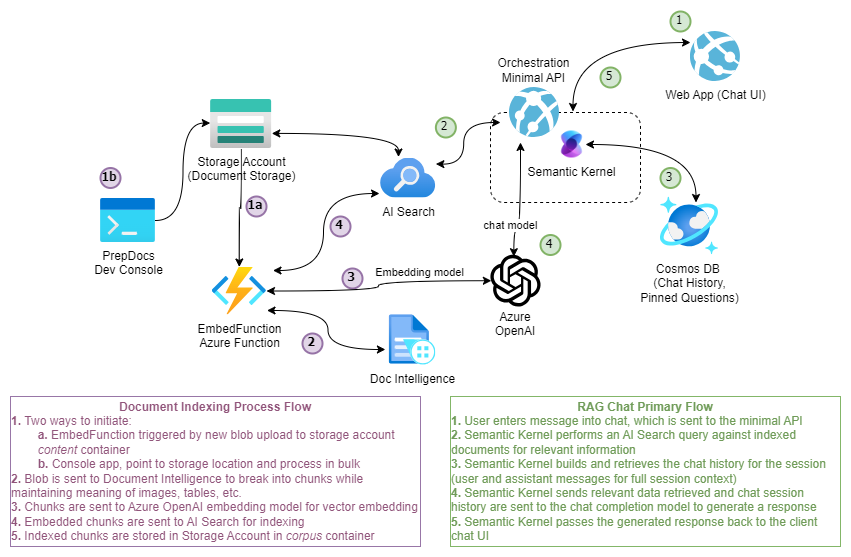

# Standard Chat with Enterprise Documents (.NET)
> A Blazor chat app over a minimal API implementation of a Semantic Kernel ochestrated Retrieval Augmented Generation (RAG) pattern using Azure OpenAI, AI Search and Document Intelligence. 

This example project used the below sample as a starting point, with simplifications and adjustments. 

[https://github.com/Azure-Samples/azure-search-openai-demo-csharp](https://github.com/Azure-Samples/azure-search-openai-demo-csharp)

### Contents

- [Features](#features)
- [Application Architecture](#application-architecture)
- [Azure account requirements](#account-requirements)
- [Project setup](#project-setup)
- [Deployment](#deployment)
- [Using the app](#using-the-app)
- [Considerations](#considerations)
- [Resources](#resources)

## What is RAG?
Retrieval Augmented Generation, or RAG pattern applications opinionated AI applications that pair the power of generative AI with curated data in order to allow users to chat with their own data. As illustrated in the diagram below, orchestration is done on an app server, which retrieves relevant data based on a natural language query, and passes that information to the model answer the user's question. 


## Application architecture



- **User Interface** – The application’s chat interface is a [Blazor WebAssembly](https://learn.microsoft.com/aspnet/core/blazor/) application. This interface is what accepts user queries, routes request to the application backend, and displays generated responses.
- **Backend** – The application backend is an [ASP.NET Core Minimal API](https://learn.microsoft.com/aspnet/core/fundamentals/minimal-apis/overview). The backend, deployed to an Azure App Service, hosts the Blazor static web application and the Semantic Kernel orchestration of the different services. Services and SDKs used in the RAG chat application include:
   - [**Semantic Kernel**](https://learn.microsoft.com/en-us/semantic-kernel/overview) – orchestrates the RAG pattern completion between the services while managing chat history and other capabilities – ready for easy extension with additional plugin functions easy (more data sources, logic, actions, etc.).
   - [**Azure AI Search**](https://learn.microsoft.com/azure/search/search-what-is-azure-search) – searches indexed documents using [vector search](https://learn.microsoft.com/azure/search/search-get-started-vector) capabilities. 
   - [**Azure OpenAI Service**](https://learn.microsoft.com/azure/ai-services/openai/overview) – provides the Large Language Models to generate responses. 
- **Document Preparation** – shared embedding services are included and used by an `EmbedFunctions` Azure Function as well as a dev utility console app for chunking, embedding and indexing documents. The Azure Function is triggered on new blobs in the `content` container of the deployed storage account. For existing storage locations, the dev utility console app can be used to process an entire container in bulk. Services and SDKs used in this process include:
   - [**Document Intelligence**](https://learn.microsoft.com/en-us/azure/ai-services/document-intelligence/overview?view=doc-intel-4.0.0) – used for chunking the documents via the [pre-built layout model](https://learn.microsoft.com/en-us/azure/ai-services/document-intelligence/concept-layout?view=doc-intel-4.0.0&tabs=sample-code) for advanced handling of different document types with tables and other structures.
   - [**Azure OpenAI Service**](https://learn.microsoft.com/azure/ai-services/openai/overview) – provides the Large Language Models to generate vectoring embeddings for the indexed document chunks.
   - [**Azure AI Search**](https://learn.microsoft.com/azure/search/search-what-is-azure-search) – indexes embedded document chunks from the data stored in an Azure Storage Account. This makes the documents searchable using [vector search](https://learn.microsoft.com/azure/search/search-get-started-vector) capabilities.    

## Getting Started

### Account Requirements

In order to deploy and run this example, you'll need

- **Azure Account** - If you're new to Azure, get an [Azure account for free](https://aka.ms/free) and you'll get some free Azure credits to get started.
- **Azure subscription with access enabled for the Azure OpenAI service** - [You can request access](https://aka.ms/oaiapply). You can also visit [the Cognitive Search docs](https://azure.microsoft.com/free/cognitive-search/) to get some free Azure credits to get you started.
- **Azure account permissions** - Your Azure Account must have `Microsoft.Authorization/roleAssignments/write` permissions, such as [User Access Administrator](https://learn.microsoft.com/azure/role-based-access-control/built-in-roles#user-access-administrator) or [Owner](https://learn.microsoft.com/azure/role-based-access-control/built-in-roles#owner).

> [!WARNING]<br>
> By default this sample will create an Azure AI Search resource that has a monthly cost, as well as Document Intelligence (previously Form Recognizer) resource that has cost per document page. You can switch them to free versions of each of them if you want to avoid this cost by changing the parameters file under the infra folder (though there are some limits to consider)

### Cost estimation

Pricing varies per region and usage, so it isn't possible to predict exact costs for your usage. However, you can try the [Azure pricing calculator](https://azure.microsoft.com/pricing/calculator/) for the resources below:

- [**Azure App Service**](https://azure.microsoft.com/en-us/pricing/details/app-service/linux/)
- [**Azure Functions**](https://azure.microsoft.com/en-us/pricing/details/functions/)
- [**Azure OpenAI Service**](https://azure.microsoft.com/pricing/details/cognitive-services/openai-service/)
- [**Azure Document Intelligence**](https://azure.microsoft.com/pricing/details/form-recognizer/)
- [**Azure AI Search**](https://azure.microsoft.com/pricing/details/search/)
- [**Azure Blob Storage**](https://azure.microsoft.com/pricing/details/storage/blobs/)
- [**Azure Monitor**](https://azure.microsoft.com/pricing/details/monitor/)

### Project setup

You have a few options for setting up this project. The easiest way to get started is GitHub Codespaces, since it will setup all the tools for you, but you can also set it up [locally](#local-environment) if desired.

#### GitHub Codespaces

You can run this repo virtually by using GitHub Codespaces, which will open a web-based VS Code in your browser:

[](https://github.com/codespaces/new?hide_repo_select=true&ref=main&repo=624102171&machine=standardLinux32gb&devcontainer_path=.devcontainer%2Fdevcontainer.json&location=WestUs2)

#### VS Code Remote Containers

A related option is VS Code Remote Containers, which will open the project in your local VS Code using the [Dev Containers](https://marketplace.visualstudio.com/items?itemName=ms-vscode-remote.remote-containers) extension:

[](https://vscode.dev/redirect?url=vscode://ms-vscode-remote.remote-containers/cloneInVolume?url=https://github.com/azure-samples/azure-search-openai-demo-csharp)

#### Local environment

Install the following prerequisites:

- [Azure Developer CLI](https://aka.ms/azure-dev/install)
- [.NET 8](https://dotnet.microsoft.com/download/dotnet/8.0)
- [Git](https://git-scm.com/downloads)
- [Powershell 7+ (pwsh)](https://github.com/powershell/powershell) - For Windows users only.
  
   > **Important**<br> 
   > Ensure you can run `pwsh.exe` from a PowerShell command. If this fails, you likely need to upgrade PowerShell.

- [Docker](https://www.docker.com/products/docker-desktop/)

   > **Important**<br>
   > Ensure Docker is running before running any `azd` provisioning / deployment commands.

Then, run the following commands to get the project on your local environment:

   1. Run `azd auth login`
   1. Clone the repository or run `azd init -t azure-search-openai-demo-csharp`
   1. Run `azd env new azure-search-openai-demo-csharp`

### Deployment

#### Deploying from scratch

> **Important**<br>
> Ensure Docker is running before running any `azd` provisioning / deployment commands.

Execute the following command, if you don't have any pre-existing Azure services and want to start from a fresh deployment.

1. Run `azd up` - This will provision Azure resources and deploy this sample to those resources, including building the search index based on the files found in the `./data` folder.
   - For the target location, the regions that currently support the model used in this sample are **East US 2** , **East US** or **South Central US**. For an up-to-date list of regions and models, check [here](https://learn.microsoft.com/azure/cognitive-services/openai/concepts/models)
   - If you have access to multiple Azure subscriptions, you will be prompted to select the subscription you want to use. If you only have access to one subscription, it will be selected automatically.

   > **Note**<br>
   > This application uses the `gpt-35-turbo` model. When choosing which region to deploy to, make sure they're available in that region (i.e. EastUS). For more information, see the [Azure OpenAI Service documentation](https://learn.microsoft.com/azure/cognitive-services/openai/concepts/models#gpt-35-models).

1. After the application has been successfully deployed you will see a URL printed to the console. Click that URL to interact with the application in your browser.

It will look like the following:


> [!NOTE]<br>
> It may take a few minutes for the application to be fully deployed.

#### Use existing resources

If you have existing resources in Azure that you wish to use, you can configure `azd` to use those by setting the following `azd` environment variables:

1. Run `azd env set AZURE_OPENAI_SERVICE {Name of existing OpenAI service}`
1. Run `azd env set AZURE_OPENAI_RESOURCE_GROUP {Name of existing resource group that OpenAI service is provisioned to}`
1. Run `azd env set AZURE_OPENAI_CHATGPT_DEPLOYMENT {Name of existing ChatGPT deployment}`. Only needed if your ChatGPT deployment is not the default 'chat'.
1. Run `azd env set AZURE_OPENAI_EMBEDDING_DEPLOYMENT {Name of existing embedding model deployment}`. Only needed if your embedding model deployment is not the default `embedding`.
1. Run `azd up`

> [!NOTE]<br> 
> You can also use existing Search and Storage Accounts. See `./infra/main.parameters.json` for list of environment variables to pass to `azd env set` to configure those existing resources.

#### Deploying or re-deploying a local clone of the repo

> [!IMPORTANT]<br>
> Ensure Docker is running before running any `azd` provisioning / deployment commands.

- Run `azd up`

#### Deploying your repo using App Spaces

> [!NOTE]<br>
> Make sure you have AZD supported bicep files in your repository and add an initial GitHub Actions Workflow file which can either be triggered manually (for initial deployment) or on code change (automatically re-deploying with the latest changes)
> To make your repository compatible with App Spaces, you need to make changes to your main bicep and main parameters file to allow AZD to deploy to an existing resource group with the appropriate tags.

1. Add AZURE_RESOURCE_GROUP to main parameters file to read the value from environment variable set in GitHub Actions workflow file by App Spaces.
   ```json
   "resourceGroupName": {
      "value": "${AZURE_RESOURCE_GROUP}"
    }
   ```
2. Add AZURE_TAGS to main parameters file to read the value from environment variable set in GitHub Actions workflow file by App Spaces.
   ```json
   "tags": {
      "value": "${AZURE_TAGS}"
    }
   ```
3. Add support for resource group and tags in your main bicep file to read the value being set by App Spaces.
   ```bicep
   param resourceGroupName string = ''
   param tags string = ''
   ```
4. Combine the default tags set by Azd with those being set by App Spaces. Replace _tags initialization_ in your main bicep file with the following -
   ````bicep
   var baseTags = { 'azd-env-name': environmentName }
   var updatedTags = union(empty(tags) ? {} : base64ToJson(tags), baseTags)
   Make sure to use "updatedTags" when assigning "tags" to resource group created in your bicep file and update the other resources to use "baseTags" instead of "tags". For example -
   ```json
   resource rg 'Microsoft.Resources/resourceGroups@2021-04-01' = {
     name: !empty(resourceGroupName) ? resourceGroupName : '${abbrs.resourcesResourceGroups}${environmentName}'
     location: location
     tags: updatedTags
   }
   ````

#### Running locally

Optionally set up a `local.settings.json` file:
``` json
{
    "Logging": {
      "LogLevel": {
        "Default": "Information",
        "Microsoft.AspNetCore": "Warning"
      }
    },
    "AllowedHosts": "*",
    "AZURE_CLIENT_ID": "",
    "APPLICATIONINSIGHTS_CONNECTION_STRING": "",
    "AZURE_KEY_VAULT_ENDPOINT": "",
    "AZURE_STORAGE_BLOB_ENDPOINT": "",
    "AZURE_STORAGE_CONTAINER": "content",
    "AZURE_SEARCH_SERVICE_ENDPOINT": "",
    "AZURE_SEARCH_INDEX": "gptkbindex",
    "AZURE_FORMRECOGNIZER_SERVICE_ENDPOINT": "",
    "AZURE_OPENAI_ENDPOINT": "",
    "AZURE_OPENAI_CHATGPT_DEPLOYMENT": "chat",
    "AZURE_OPENAI_EMBEDDING_DEPLOYMENT": "embedding",
    "USE_AOAI":  "true"
  }
```

1. Run `azd auth login`
2. After the application deploys, set the environment variable `AZURE_KEY_VAULT_ENDPOINT`. You can find the value in the _.azure/YOUR-ENVIRONMENT-NAME/.env_ file, the `local.settings.json` file, or the Azure portal.
3. Run the following .NET CLI command to start the ASP.NET Core Minimal API server (client host):

   ```dotnetcli
   dotnet run --project ./app/backend/MinimalApi.csproj --urls=http://localhost:7181/
   ```

Navigate to <http://localhost:7181>, and test out the app.

#### Clean up resources

Run `azd down`

### Using the app

- In Azure: navigate to the Azure App Service deployed by `azd`. The URL is printed out when `azd` completes (as "Endpoint"), or you can find it in the Azure portal.
- When running locally, navigate to <http://localhost:7181> for the client app and <http://localhost:7181/swagger> for the Open API server page.

Once in the web app:

- Try different topics in **Chat** context. For chat, try follow up questions, clarifications, ask to simplify or elaborate on answer, etc.
- Explore citations and sources
- Click on the "settings" icon to try different options, tweak prompts, etc.

### Tracing and Troubleshooting

In Azure, navigate to the Application Insights deployed by `azd`.


To see any exceptions and server errors, navigate to the "Investigate -> Failures" blade and use the filtering tools to locate a specific exception. You can see stack traces on the right-hand side.

## Considerations

This example is designed to be a starting point for your own production application, but on it's own is not production ready. Some additional considerations, although not exhaustive, are below. 

* **OpenAI Capacity**: The default TPM (tokens per minute) is set to 30K. That is equivalent to approximately 30 conversation turns per minute (assuming 1K per user message/response). You can increase the capacity by changing the `chatGptDeploymentCapacity` and `embeddingDeploymentCapacity` parameters in `infra/main.bicep` to your account's maximum capacity. You can also view the Quotas tab in [Azure OpenAI studio](https://oai.azure.com/) to understand how much capacity you have.
* **Azure Storage**: The default storage account uses the `Standard_LRS` SKU. To improve your resiliency, consider using `Standard_ZRS` for production deployments, which you can specify using the `sku` property under the `storage` module in `infra/main.bicep`.
* **Azure AI Search**: If you see errors about search service capacity being exceeded, you may find it helpful to increase the number of replicas by changing `replicaCount` in `infra/core/search/search-services.bicep` or manually scaling it from the Azure Portal.
* **API Management**: 
* **Networking**: We recommend deploying inside a Virtual Network. If the app is only for internal enterprise use, use a private DNS zone. Also consider using Azure API Management (APIM) for firewalls and other forms of protection. For more details, read [Azure OpenAI Landing Zone reference architecture](https://techcommunity.microsoft.com/t5/azure-architecture-blog/azure-openai-landing-zone-reference-architecture/ba-p/3882102).

## Resources

- [https://github.com/Azure-Samples/azure-search-openai-demo-csharp](https://github.com/Azure-Samples/azure-search-openai-demo-csharp)
- [Revolutionize your Enterprise Data with ChatGPT: Next-gen Apps w/ Azure OpenAI and Cognitive Search](https://aka.ms/entgptsearchblog)
- [Azure AI Search](https://learn.microsoft.com/azure/search/search-what-is-azure-search)
- [Azure OpenAI Service](https://learn.microsoft.com/azure/cognitive-services/openai/overview)
- [`Azure.AI.OpenAI` NuGet package](https://www.nuget.org/packages/Azure.AI.OpenAI)

> [!NOTE]<br>
> The PDF documents used in this demo contain information generated using a language model (Azure OpenAI Service). The information contained in these documents is only for demonstration purposes and does not reflect the opinions or beliefs of Microsoft. Microsoft makes no representations or warranties of any kind, express or implied, about the completeness, accuracy, reliability, suitability or availability with respect to the information contained in this document. All rights reserved to Microsoft.