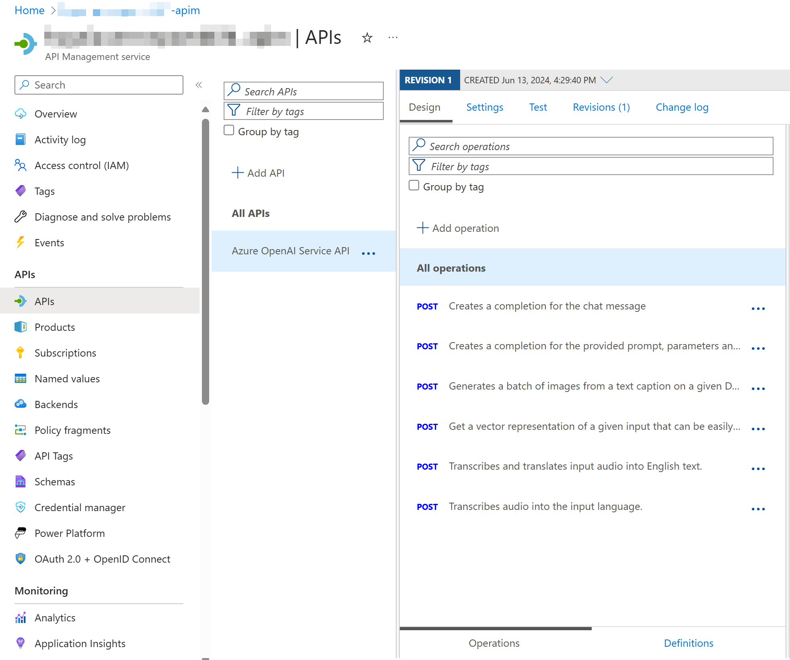
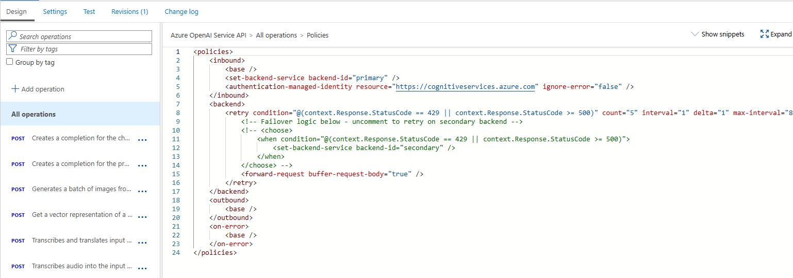
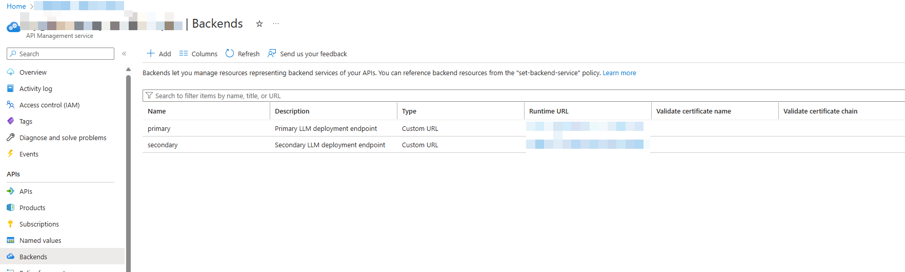

# Deployment 
This project supports `azd` for easy deployment of the complete application, as defined in the main.bicep resources. 

Standalone APIM gateway only templates are also included for optionally deploying and configuring an Azure API Management gateway to use in between the application and Azure OpenAI deployments for scalability and failover.  

## Contents
* [Complete Main Deployment](#complete-main-deployment)
   * [Deploying from scratch](#deploying-from-scratch)
   * [Use existing resources](#use-existing-resources)
   * [Configure UI authentication](#configure-ui-authentication)
* [Optionally deploy and configure APIM](#optionally-deploy-and-configure-apim)
   * [Check the APIM deployment](#check-the-apim-deployment)

## Complete Main Deployment
Use `azd` to deploy the main resources. This requires the [Azure Developer CLI](https://learn.microsoft.com/en-us/azure/developer/azure-developer-cli/install-azd?tabs=winget-windows%2Cbrew-mac%2Cscript-linux&pivots=os-windows) to be installed on your machine. 

### Deploying from scratch

Execute the following command, if you don't have any pre-existing Azure services and want to start from a fresh deployment.

1. Run `azd up` - This will provision Azure resources and deploy this sample to those resources.
   - For the target location, see an up-to-date list of regions and models [here](https://learn.microsoft.com/azure/cognitive-services/openai/concepts/models)
   - If you have access to multiple Azure subscriptions, you will be prompted to select the subscription you want to use. If you only have access to one subscription, it will be selected automatically.

   > **Notes**<br>
   > This application uses the `gpt-4o` model. When choosing which region to deploy to, make sure they're available in that region (i.e. EastUS). For more information, see the [Azure OpenAI Service documentation](https://learn.microsoft.com/azure/cognitive-services/openai/concepts/models).
   > This application also requires a preview version of Document Intelligence (for O365 document support), which at the time of publishing this project is only available in EastUS or WestUS2 or WestEurope regions. Document processing will not work if not deployed in a region with this preview support. See [documentation](https://learn.microsoft.com/en-us/azure/ai-services/document-intelligence/overview?view=doc-intel-4.0.0) to check preview status and availability.

1. After the application has been successfully deployed you will see a URL printed to the console. Click that URL to interact with the application in your browser.

It will look like the following:


> [!NOTE]<br>
> It may take a few minutes for the application to be fully deployed.

### Use existing resources

If you have existing resources in Azure that you wish to use, you can configure `azd` to use those by setting the following `azd` environment variables:

1. Run `azd env set AZURE_OPENAI_SERVICE {Name of existing OpenAI service}`
1. Run `azd env set AZURE_OPENAI_RESOURCE_GROUP {Name of existing resource group that OpenAI service is provisioned to}`
1. Run `azd env set AZURE_OPENAI_CHATGPT_DEPLOYMENT {Name of existing ChatGPT deployment}`. Only needed if your ChatGPT deployment is not the default 'chat'.
1. Run `azd env set AZURE_OPENAI_EMBEDDING_DEPLOYMENT {Name of existing embedding model deployment}`. Only needed if your embedding model deployment is not the default `embedding`.
1. Run `azd up`

> [!NOTE]<br> 
> You can also use existing Search and Storage Accounts. See `./infra/main.parameters.json` for list of environment variables to pass to `azd env set` to configure those existing resources.

### Configure UI Authentication
To enable persistence of chat session history and pinning of preferred queries per user, authentication needs to be enabled on the deployed App Service that hosts the minimal API and web client. 

1. In the Azure portal, find and open the deployed App Service
1. Browse into the `Settings/Authentication` blade and click `Add identity provider`
1. To use Azure Entra for user sign-in, select Microsoft as the identity provider, leave all default settings, and click `Add`. 
1. Return to the Overview blade of the App Service, and restart.


## Optionally Deploy and Configure APIM
Using the Azure CLI, use the `gatewayOnly.bicep` template to deploy and setup APIM for Azure OpenAI connectivity.

```powershell
az deployment group create -g [RESOURCE_GROUP_NAME] --template-file gatewayOnly.bicep --parameters "aoaiPrimaryAccount=[AZURE_OPENAI_NAME]" --parameters "aoaiSecondaryAccount=[AZURE_OPENAI_NAME]" --parameters "applicationInsightsName=[APP_INSIGHTS_NAME]"
```

* `[RESOURCE_GROUP_NAME]`: Name of the resource group to deploy to
* `[AZURE_OPENAI_NAME]`: The resource name your Azure OpenAI deployments are in. If you only have one Azure OpenAI resource, you can use the same name in both Primary and Secondary. The policy to enable fail over is included as an example, but is not enabled by default.
* `[APP_INSIGHTS_NAME]`: name of App Insights resource for logging

Use the optional parameters below by adding each in the following format to the command above:

```powershell
--parameters "[PARAMETER]=[VALUE]
```

| Parameter | Use | Value |
|---|---|---|
| apimName | if deploying to an existing APIM resource | the name of the APIM resource |
| managedIdentityPrincipalName | if not included, APIM will be provisioned with a system defined identity. Use this parameter to specifiy a user-defined identity instead | the name of the service principal to set as the managed identity |
| sku | specify the desired sku (default is consumption) | Options are: 'Consumption' 'Developer' 'Standard' 'Premium' |
| skuCount | if specifying the sku, this may be required to define the instance size | Options are: 0, 1, 2 |

### Check the APIM Deployment

#### API Definition
Open the deployed API Managmeent resource to confirm deployed configurations.

In the `APIs` blade, an API definition for Azure OpenAI is created with all available operations:



#### InBound Policies

In the API definition, click on `All operations` and then the `</>` icon in the InBound processing tile to see the policies applied:



### Backends

Click the `Backends` blade to see the primary and secondary backends defined:



